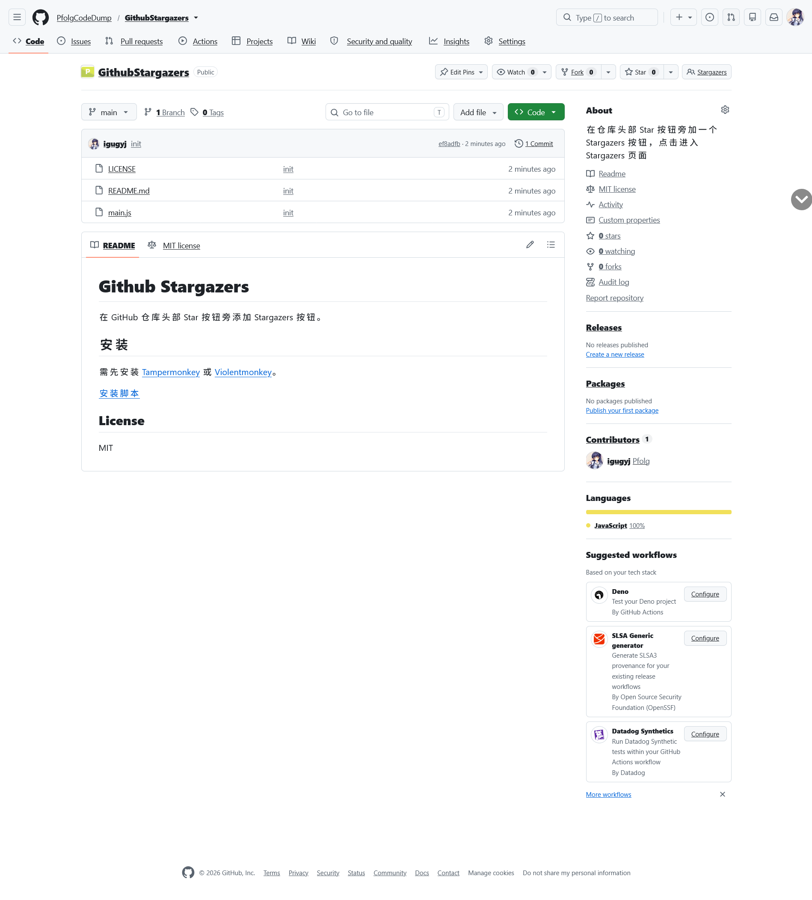

# Github Stargazers

在 GitHub 仓库头部 Star 按钮旁添加 Stargazers 按钮。

## 预览

## 安装

需先安装 [Tampermonkey](https://www.tampermonkey.net/) 或 [Violentmonkey](https://violentmonkey.github.io/)。

安装脚本：[GitHub](../../raw/main/main.js) | [Greasy Fork](https://greasyfork.org/scripts/597640/)

## License

MIT
